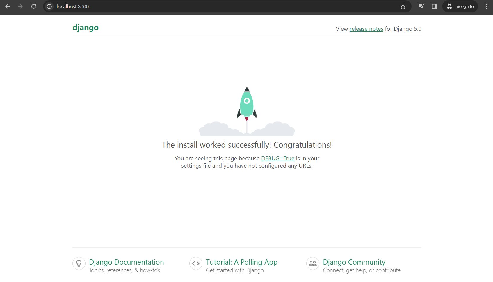

# 01 - Getting Started

https://www.youtube.com/watch?v=UmljXZIypDc&list=PL-osiE80TeTtoQCKZ03TU5fNfx2UY6U4p

## Installation

**MAKE SURE THAT YOU ARE IN A VIRTUAL ENVIRONMENT** ([using a virtual environment](https://github.com/lightzane/learn-python/blob/main/main.py#L5))

```bash
pip install django
```

## Verify installation

```bash
python -m django --version
```

Result: `5.0.2`

## Django Admin

This command should be available once after installation.

```bash
django-admin --version
```

Result: `5.0.2`

### Subcommands

```bash
django-admin
```

**RESULT**

```bash
Type 'django-admin help <subcommand>' for help on a specific subcommand.

Available subcommands:

[django]
    check
    compilemessages
    createcachetable
    dbshell
    diffsettings
    dumpdata
    flush
    inspectdb
    loaddata
    makemessages
    makemigrations
    migrate
    optimizemigration
    runserver
    sendtestemail
    shell
    showmigrations
    sqlflush
    sqlmigrate
    sqlsequencereset
    squashmigrations
    startapp
    startproject
    test
    testserver
Note that only Django core commands are listed as settings are not properly configured (error: Requested setting INSTALLED_APPS, but settings are not configured. You must either define the environment variable DJANGO_SETTINGS_MODULE or call settings.configure() before accessing settings.).
```

## Starting a Project

```bash
django-admin startproject <proj_name>
```

**OUTPUT**

```txt
.
└─  proj_name
│     ├─  proj_name
│     │    ├─  __init__.py
│     │    ├─  asgi.py
│     │    ├─  settings.py
│     │    ├─  urls.py
│     │    └─  wsgi.py
│     └─  manage.py
├─  .gitignore
└─  README.md
```

> **A single project can contain multiple apps**

`manage.py` - This will be our commander when running servers, starting apps, etc.
`wsgi.py` - this is how the Python web application and web server communicate

## Initial URL

`urls.py`

```py
from django.contrib import admin
from django.urls import path

urlpatterns = [
    path('admin/', admin.site.urls),
]
```

## Open default website

Go inside the `proj_name` parent folder and run the following command:

```bash
python manage.py runserver
```

**OUTPUT**

```bash
Watching for file changes with StatReloader
Performing system checks...

System check identified no issues (0 silenced).

You have 18 unapplied migration(s). Your project may not work properly until you apply the migrations for app(s): admin, auth, contenttypes, sessions.
Run 'python manage.py migrate' to apply them.
February 20, 2024 - 20:29:42
Django version 5.0.2, using settings 'proj_name.settings'
Starting development server at http://127.0.0.1:8000/
Quit the server with CTRL-BREAK.
```

> **NOTICE**: 18 unapplied migration, DO NOT RUN python manage.py migrate for now...

You can now visit browser on the following URL: http://localhost:8000



### `manage.py` list of available arguments

To see other available arguments other than `runserver`, run the following command:

```bash
python manage.py
```

Without arguments, this will output a list of available arguments instead

**OUTPUT**

```bash
Type 'manage.py help <subcommand>' for help on a specific subcommand.

Available subcommands:

[auth]
    changepassword
    createsuperuser

[contenttypes]
    remove_stale_contenttypes

[django]
    check
    compilemessages
    createcachetable
    dbshell
    diffsettings
    dumpdata
    flush
    inspectdb
    loaddata
    makemessages
    makemigrations
    migrate
    optimizemigration
    sendtestemail
    shell
    showmigrations
    sqlflush
    sqlmigrate
    sqlsequencereset
    squashmigrations
    startapp
    startproject
    test
    testserver

[sessions]
    clearsessions

[staticfiles]
    collectstatic
    findstatic
    runserver
```

## Admin Route

If you remember checking the `urls.py` in [Initial URL](#initial-url) section. We can access it via `http://localhost:8000/admin`


## Shutting down the server

Use `Ctrl + C` shortcut. (may take twice or more)
