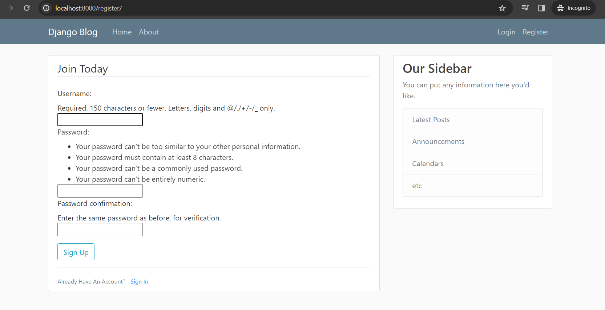
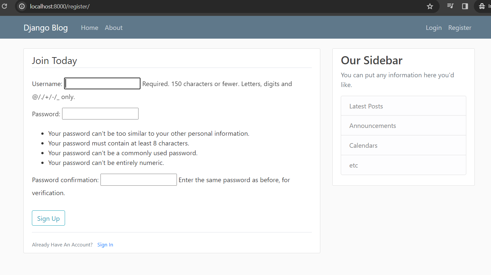
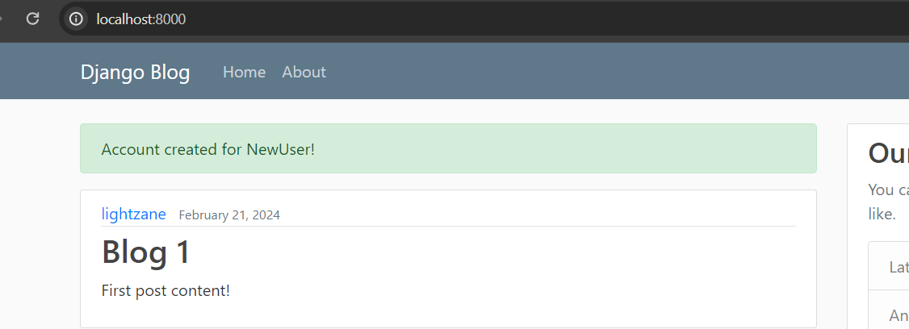
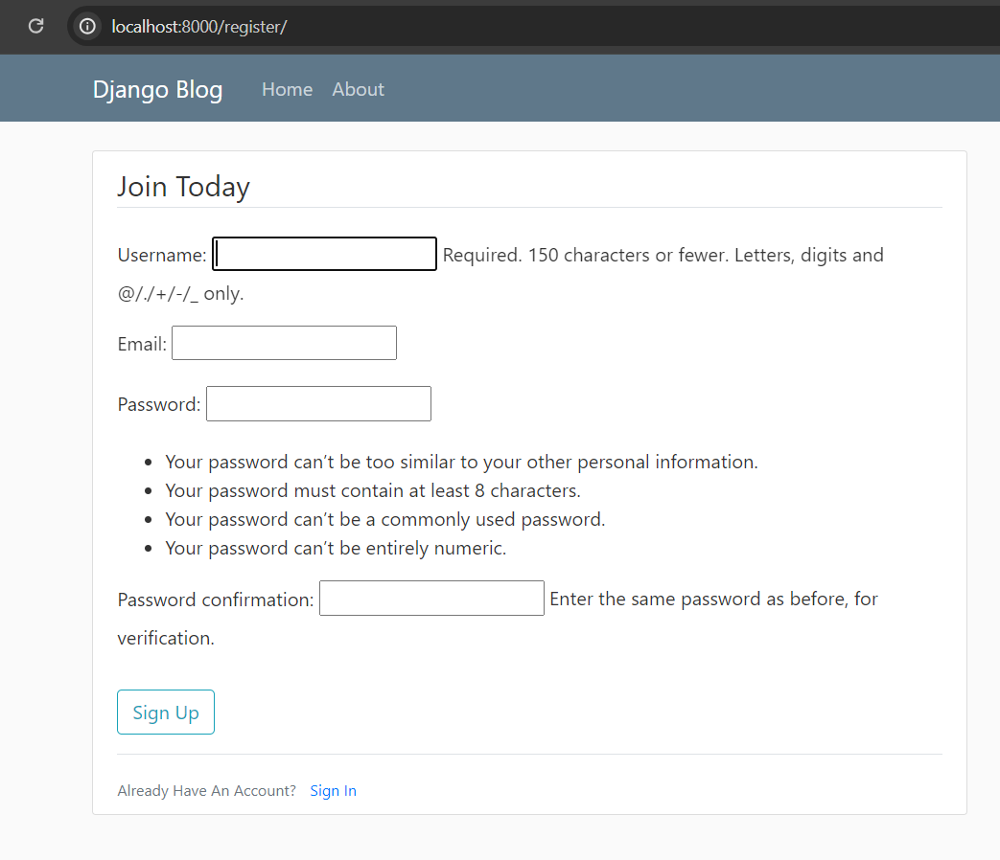
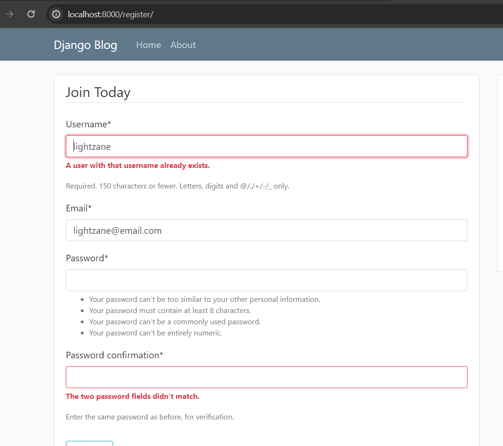

# 06 - User Registration

https://www.youtube.com/watch?v=q4jPR-M0TAQ&list=PL-osiE80TeTtoQCKZ03TU5fNfx2UY6U4p

## Create a user app

```bash
python manage.py startapp users
```

## Update `settings.py`

Install `users` app based on `AppConfig` in `users/apps.py`

```diff
 ...

 INSTALLED_APPS = [
+    'users.apps.UsersConfig',
     'blog.apps.BlogConfig',
     ...
 ]

 ...
```

## Update `views.py`

### Create Registration form

We can make our own **HTML** template but **Django** also already provided a **registration template** that we can use.

```py
from django.contrib.auth.forms import UserCreationForm
```

`users/views.py`

```py
from django.shortcuts import render
from django.contrib.auth.forms import UserCreationForm

def register(request):
    form = UserCreationForm()
    return render(request, 'users/register.html', {
        'form': form
    })

```

## Create HTML template

`users/template/users/register.html`

<!-- prettier-ignore -->
```html



    <div class="content-section">
        <form method="post">
            
            <fieldset class="form-group">
                <legend class="border-bottom mb-4">Join Today</legend>
                {{ form }}
            </fieldset>
            <div class="form-group">
                <button class="btn btn-outline-info" type="submit">Sign Up</button>
            </div>
        </form>

        <div class="border-top pt-3">
            <small class="text-muted">
                Already Have An Account? <a class="ml-2" href="#">Sign In</a>
            </small>
        </div>
    </div>

```

## Create Route for Register HTML

You may think of adding URL to `users/urls.py` but we can also do another approach to _directly_ put the **users router** in the `proj_name/urls.py`

```diff
 from django.contrib import admin
 from django.urls import path, include
+from users import views as user_views

 urlpatterns = [
     path('admin/', admin.site.urls),
+    path('register/', user_views.register, name='register'),
     path('', include('blog.urls'))
 ]
```

## Run server and verify



## Render form in paragraph text

Update `register.html`

```html
{{ form.as_p }}
```



## Update Registration logic

`users/views.py`

```py
from django.shortcuts import render, redirect
from django.contrib.auth.forms import UserCreationForm
from django.contrib import messages
from django.http import HttpRequest # for typings

def register(request: HttpRequest):

    if request.method == 'POST':
        form = UserCreationForm(request.POST)

        if form.is_valid():
            username = form.cleaned_data.get('username')
            messages.success(request, f'Account created for {username}!') # F-strings from Python 3.6+
            return redirect('blog-home') # url pattern for our Blog home page

    else:
        form = UserCreationForm()

    return render(request, 'users/register.html', {
        'form': form
    })

```

## Pass success message in `base.html`

```diff
<!-- * M A I N * -->
<main role="main" class="container">
  <div class="row">
    <div class="col-md-8">
+     
+       
+         <div class="alert alert-{{ message.tags }}">
+           {{ message }}
+         </div>
+       
+     
      <!-- 'content' is arbitrary name -->
      
    </div>
```

## Test submitting register



## Save form in database

`users/views.py`

```diff
...

 if form.is_valid():
+   form.save() # save to database
    username = form.cleaned_data.get('username')

...
```

## Adding more fields in form

Create `users/forms.py` file

```py
from django import forms
from django.contrib.auth.models import User
from django.contrib.auth.forms import UserCreationForm

class UserRegistrationForm(UserCreationForm):
    email = forms.EmailField()

    class Meta: # Gives us a nested namespace
        model = User # It will save it into this user model
        fields = ['username', 'email', 'password1', 'password2'] # Set fields in order

```

## Inherift the form we created in `users/views.py`

```diff
 from django.shortcuts import render, redirect
-from django.contrib.auth.forms import UserCreationForm
 from django.contrib import messages
 from django.http import HttpRequest # for typings
+from .forms import UserRegistrationForm

 def register(request: HttpRequest):

     if request.method == 'POST':
-        form = UserCreationForm(request.POST)
+        form = UserRegistrationForm(request.POST)

         if form.is_valid():
             form.save() # save to database
             username = form.cleaned_data.get('username')
             messages.success(request, f'Account created for {username}!') # F-strings from Python 3.6+
             return redirect('blog-home') # url pattern for our Blog home page
         # * Remember to pass the success message (i.e. in `base.html` template)

     else:
-        form = UserCreationForm()
+        form = UserRegistrationForm()

     return render(request, 'users/register.html', {
         'form': form
     })

```

Run server and see the updated registration form:



## Style Forms

We want to put styles only on templates.

### Install `django-crispy-forms`

Popular way to do this in Django is **Crispy Forms**

```bash
pip install django-crispy-forms
pip install crispy-bootstrap4
```

Reference: https://django-crispy-forms.readthedocs.io/en/latest/install.html#installation

### Add to `INSTALLED_APPS`

`settings.py`

```diff
 INSTALLED_APPS = [
     ...
+   'crispy_forms',
+   'crispy_bootstrap4',
     ...
 ]

 ...

+CRISPY_TEMPLATE_PACK = "bootstrap4" # check documentation for django-crispy-forms
```

### Load crispy forms in `register.html`

```diff
 
+
 
```

We can now remove `.as_p` in `{{ form.as_p }}` and replaced with:

```html
{{ form | cripsy }}
```

#### Run server and see updated registration form


