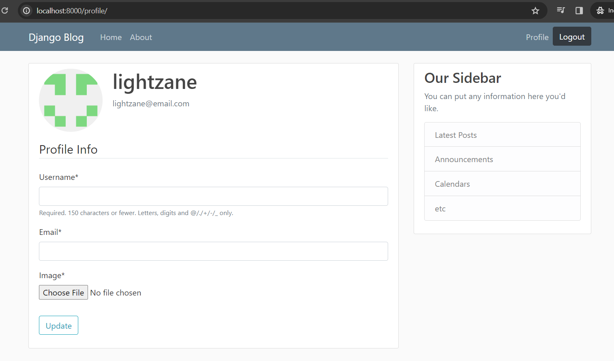

# 09 - Update User Profile

https://www.youtube.com/watch?v=CQ90L5jfldw&list=PL-osiE80TeTtoQCKZ03TU5fNfx2UY6U4p

## Create additional forms for user update

`users/forms.py`

```py
...

class UserUpdateForm(forms.ModelForm):
    email = forms.EmailField()

    class Meta:
        model = User
        fields = ['username', 'email']

class ProfileUpdateForm(forms.ModelForm):
    class Meta:
        model = Profile
        fields = ['image']
```

## Update views to implement those forms

`users/views.py`

```diff
 ...
+from .forms import UserRegistrationForm, UserUpdateForm, ProfileUpdateForm

 @login_required
 def profile(request):
+    u_form = UserUpdateForm()
+    p_form = ProfileUpdateForm()

+    context = {
+        'u_form': u_form,
+        'p_form': p_form
+    }

-    return render(request, 'users/profile.html')
+    return render(request, 'users/profile.html', context)

```

## Update template to display the form

`users/templates/users/profile.html`

```diff



    <!-- `user` variable is built-in within Django -->
    <div class="content-section">
        ...
        <!-- FORM HERE -->
+       <form method="post" enctype="multipart/form-data">
+           <!-- multipart/form-data allows it to read uploaded files (image.png) -->
+           
+           <fieldset class="form-group">
+               <legend class="border-bottom mb-4">Profile Info</legend>
+               {{ u_form | crispy }}
+               {{ p_form | crispy }}
+           </fieldset>
+           <div class="form-group">
+               <button class="btn btn-outline-info" type="submit">Update</button>
+           </div>
+       </form>
    </div>

```

You can now `runserver` and verify changes in the **UI**.

**But do not try submitting anything yet**



Notice that it does not contain the current values.

### Update form with current values

`views.py`

```diff
 @login_required
+def profile(request: HttpRequest):

+    if request.POST:
+        u_form = UserUpdateForm(request.POST, instance=request.user)
+        p_form = ProfileUpdateForm(
+            request.POST,
+            request.FILES,
+            instance=request.user.profile
+        )
+
+        if u_form.is_valid() and p_form.is_valid():
+            u_form.save()
+            p_form.save()
+
+            messages.success(request, f'Your account has been updated!')
+            return redirect('profile') # name of the path url for the profile page
+
+    else:
+        u_form = UserUpdateForm(instance=request.user)
+        p_form = ProfileUpdateForm(instance=request.user.profile)

     context = {
         'u_form': u_form,
         'p_form': p_form
     }

     return render(request, 'users/profile.html', context)
```

You can `runserver` and submit your profile updates!

## Resize images to upload

`users/models.py`

```diff
 ...

+from PIL import Image

 class Profile(models.Model):

     ...

+    # Sample for overriding the models.Model.save()
+    def save(self):
+        super().save()
+
+        img = Image.open(self.image.path)
+
+        if img.height > 300 or img.width > 300:
+            output_size = (300, 300)
+            img.thumbnail(output_size)
+            img.save(self.image.path)

```

Now try upload large sizes !

## Display image on each user blog posts

`blog/templates/blog/home.html`

```diff
<article class="media content-section">
+   
    <div class="media-body">
        <div class="article-metadata">
        <a class="mr-2" href="#">{{ post.author }}</a>
        <small class="text-muted">{{ post.date_posted | date:"F d, Y" }}</small>
        </div>
        <h2><a class="article-title" href="#">{{ post.title }}</a></h2>
        <p class="article-content">{{ post.content }}</p>
    </div>
</article>
```
