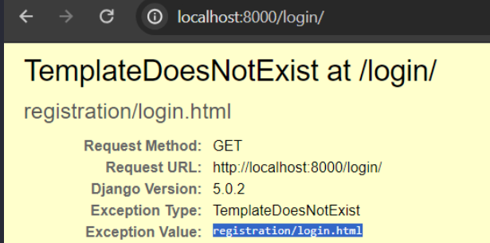

# 07 - Login and Logout System

https://www.youtube.com/watch?v=3aVqWaLjqS4&list=PL-osiE80TeTtoQCKZ03TU5fNfx2UY6U4p

## Create Login/Logout View Built-in from Django

`proj_name/urls.py`

```diff
 from django.contrib import admin
+from django.contrib.auth import views as auth_views
 from django.urls import path, include
 from users import views as user_views

 urlpatterns = [
     path('admin/', admin.site.urls),
     path('register/', user_views.register, name='register'),
+    path('login/', auth_views.LoginView.as_view(), name='login'),
+    path('logout/', auth_views.LogoutView.as_view(), name='logout'),
     path('', include('blog.urls'))
 ]

```

If you try run the server and visit `http://localhost:8000/login`, you would get this error:



### Specify template name for login and logout

By default, it is looking for the `registration/login.html`.

We can create our own template and tell **Django** to use it instead.

`proj_name/urls.py`

```py
path('login/',
    auth_views.LoginView.as_view(template_name='users/login.html'),
    name='login'
),
path('logout/',
    auth_views.LogoutView.as_view(template_name='users/logout.html'),
    name='logout'
),
```

This will still give an error but it should show now that it is looking for the `users/login.html` template.

### Create Login template

`users/login.html`

<!-- prettier-ignore -->
```html



    <div class="content-section">
        <form method="post">
            
            <fieldset class="form-group">
                <legend class="border-bottom mb-4">Log In</legend>
                {{ form | crispy }}
            </fieldset>
            <div class="form-group">
                <button class="btn btn-outline-info" type="submit">Login</button>
            </div>
        </form>

        <div class="border-top pt-3">
            <small class="text-muted">
                Need an Account? <a class="ml-2" href="">Sign Up Now</a>
            </small>
        </div>
    </div>

```

Update the `href` in `register.html` to include the URL for login

```html
Need an Account? <a class="ml-2" href="">Sign Up Now</a>
```

When you try to login with valid user, it will give **page not found** for `http://localhost:8000/accounts/profile/`

### Modify login redirect in settings

By default, **Django** will redirect to `/accounts/profile` location. We can change this in `settings.py`

```py
LOGIN_REDIRECT_URL = 'blog-home' # name of the path we gave in blog homepage
```

#### Update the register view and redirect to login page instead

```diff
...
def register(request: HttpRequest):

    if request.method == 'POST':
        form = UserRegistrationForm(request.POST)

        if form.is_valid():
            form.save() # save to database
            username = form.cleaned_data.get('username')
+           messages.success(request, f'Account created for {username}! Please login') # F-strings from Python 3.6+
+           return redirect('login') # name of the path we gave for /login

        ...
    ...
```

### Create logout template

<!-- prettier-ignore -->
```html



    <h2>You have been logged out</h2>
    <div class="border-top pt-3">
        <small class="text-muted">
            <a class="ml-2" href="">Login again</a>
        </small>
    </div>

```

#### Test `/logout`

You may get an error somewhere in terminal:

```bash
[22/Feb/2024 10:49:32] "GET /logout/ HTTP/1.1" 405 0
Method Not Allowed (GET): /logout/
Method Not Allowed: /logout/
```

> Since Django v5, you need to logout through a **POST Request**, since it has side-effects.<br>Source: https://stackoverflow.com/questions/77690729/django-built-in-logout-view-method-not-allowed-get-users-logout

**Example**

```html
<form method="post" action="">
  
  <button type="submit">logout</button>
</form>
```

`csrf` = cross-site request forgery (CSRF) ^[wiki](https://en.wikipedia.org/wiki/Cross-site_request_forgery)

### Update `base.html` template to navigate login and register

```html
<a class="nav-item nav-link" href="">Login</a>
<a class="nav-item nav-link" href="">Register</a>
```

We only want to display **Login** and **Register** _when the user is NOT logged in_.

<!-- prettier-ignore -->
```html
<!-- The `user` variable is provided by **Django** -->

    <form method="post" action="">
        
        <button type="submit">logout</button>
    </form>

    <a class="nav-item nav-link" href="">Login</a>
    <a class="nav-item nav-link" href="">Register</a>

```

**You can now run server and test `login` and `logout` feature**

## Create User Profile view

Users' `views.py`

```py
def profile(request):
    return render(request, 'users/profile.html')
```

`profile.html` template

```html
  
<!-- `user` variable is built-in within Django -->
<h1>{{ user.username }}</h1>

```

Update `urls.py` for project

```py
path('profile/', user_views.profile, name='profile'),
```

Add link to profile in `base.html`

```diff

+   <a class="nav-item nav-link" href="">Profile</a>
    <form method="post" action="">
        
        <button class="btn btn-dark" type="submit">Logout</button>
    </form>

```

## `@login_required` decorator to restrict pages

Currently, anyone can access the `/profile` URL even when the user is NOT logged in.

`users/views.py`

```diff
+from django.contrib.auth.decorators import login_required

 ...

+@login_required
 def profile(request):
     return render(request, 'users/profile.html')
```

### Add fallback page for `@login_required`

Now, if you access the `/profile`, it will throw a `404 page not found` page. We can change this by adding the following in `settings.py`:

```py
LOGIN_URL = 'login' # name of path we gave for login page
```

Now if you access `/profile`, it will redirect to `/login/?next=/profile/` location instead.

And when you logged in, it will redirect us back the the `/profile` page instead of our default redirect to the _blog-home_ page.
