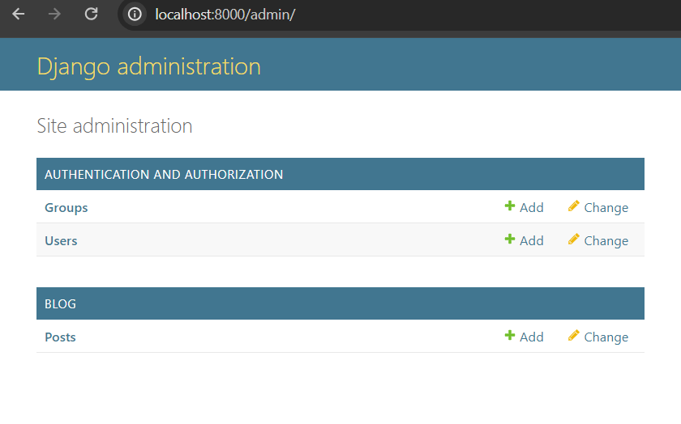
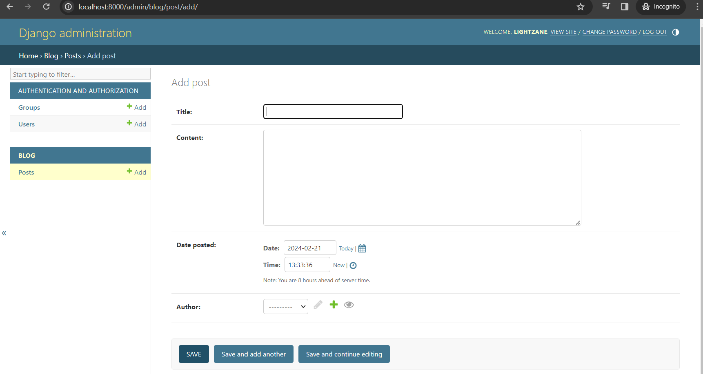

# 05 - Database and Migrations

https://www.youtube.com/watch?v=aHC3uTkT9r8&list=PL-osiE80TeTtoQCKZ03TU5fNfx2UY6U4p

**Django** has a built-in **ORM** (Object Relational Mapping)

Python **Class** = Database **Models**

We're going to use `SQLite` which is built-in in Django as well.

> Django, a high-level web framework for Python, includes built-in support for using SQLite as a database backend. SQLite is a lightweight, serverless database engine that stores data in a local file. It's a good choice for development and small to medium-sized applications.<br><br>Source: https://medium.com/@codewithbushra/using-sqlite-as-a-database-backend-in-django-projects-code-with-bushra-d23e3100686e#:~:text=Django%2C%20a%20high%2Dlevel%20web,small%20to%20medium%2Dsized%20applications.

## Open `models.py` in blog app

```py
from django.db import models

# Create your models here.

```

## Create Post model

```py
from django.db import models
from django.utils import timezone
from django.contrib.auth.models import User

# Create your models here.
class Post(models.Model):
    title = models.CharField(max_length=100)
    content = models.TextField()
    date_posted = models.DateTimeField(default=timezone.now)
    author = models.ForeignKey(User, on_delete=models.CASCADE) # 'cascade' <- if user is deleted, we want to delete their posts as well

    f""" Note
    For DateTimeField arguments:
        - auto_now      (bool) = allows to get current time on EVERY UPDATE
        - auto_now_add  (bool) = allows to get current time on CREATE but DISABLES modification
    """

```

## Run `makemigrations` command

Since we made changes in our database model, we need to call the `makemigration` command to detect those changes.

```bash
python manage.py makemigrations
```

**RESULT**

```bash
Migrations for 'blog':
  blog\migrations\0001_initial.py
    - Create model Post
```

If you're curious, you can open `blog/migraiton/0001_initial.py`. This is what **migrations** will execute to create this model.

### Viewing the SQL code

We can view the SQL command that will be executed by the `0001_initial.py`

`python manage.py sqlmigrate <app_name> <migration_number>`

```bash
python manage.py sqlmigrate blog 0001
```

**RESULT**

```bash
BEGIN;
--
-- Create model Post
--
CREATE TABLE "blog_post" ("id" integer NOT NULL PRIMARY KEY AUTOINCREMENT, "title" varchar(100) NOT NULL, "content" text
NOT NULL, "date_posted" datetime NOT NULL, "author_id" integer NOT NULL REFERENCES "auth_user" ("id") DEFERRABLE INITIALLY DEFERRED);
CREATE INDEX "blog_post_author_id_dd7a8485" ON "blog_post" ("author_id");
COMMIT;
```

## Apply `migrate` changes

```bash
python manage.py migrate
```

**RESULT**

```bash
Operations to perform:
  Apply all migrations: admin, auth, blog, contenttypes, sessions
Running migrations:
  Applying blog.0001_initial... OK
```

## Query database models using Django Python Shell

We can use the **Django Python Shell** which allows us to work with the models interactively line by line

```bash
python manage.py shell
```

**RESULT**

```bash
Python 3.12.2 (tags/v3.12.2:6abddd9, Feb  6 2024, 21:26:36) [MSC v.1937 64 bit (AMD64)] on win32
Type "help", "copyright", "credits" or "license" for more information.
(InteractiveConsole)
>>>
```

### Make few interactions

```bash
>>> from blog.models import Post
>>> from django.contrib.auth.models import User
>>> User.objects.all()
<QuerySet [<User: lightzane>, <User: qa_tester>]>
>>> User.objects.first()
<User: lightzane>
>>> User.objects.filter(username='qa_tester')
<QuerySet [<User: qa_tester>]>
>>> User.objects.filter(username='qa_tester').first()
<User: qa_tester>
>>> user = User.objects.filter(username='lightzane').first()
>>> user.id
1
>>> user.pk
1
>>> user = User.objects.get(id=1)
>>> user
<User: lightzane>
>>> Post.objects.all()
<QuerySet []>
>>> post_1 = Post(title='Blog 1', content='First post content!', author=user)
>>> Post.objects.all()
<QuerySet []>
>>> post_1.save()
>>> Post.objects.all()
<QuerySet [<Post: Post object (1)>]>
```

**NOTICE** that the output is `Post object (1)`, let's modify this by adding a `__str__` dunder in our `Post` class.

#### Update `models.py` dunder

`Dunder` = **d**ouble **under**score

```py
class Post(models.Model):

    ...

    def __str__(self) -> str:
        return self.title
```

#### Restart shell

To restart, you can use the command `quit()` or `exit()`

```bash
python manage.py shell
```

```bash
Python 3.12.2 (tags/v3.12.2:6abddd9, Feb  6 2024, 21:26:36) [MSC v.1937 64 bit (AMD64)] on win32
Type "help", "copyright", "credits" or "license" for more information.
(InteractiveConsole)
>>> from blog.models import Post
>>> from django.contrib.auth.models import User
>>> Post.objects.all()
<QuerySet [<Post: Blog 1>]>
>>>
```

#### Add another post

```bash
>>> user = User.objects.filter(username='lightzane').first()
>>> user
<User: lightzane>
>>> post_2 = Post(title='Blog 2', content='Second post content', author_id=user.id)
>>> post_2.save()
>>> Post.objects.all()
<QuerySet [<Post: Blog 1>, <Post: Blog 2>]>
```

##### Inspect a Post data

```bash
>>> post = Post.objects.first()
>>> post.content
'First post content!'
>>> post.date_posted
datetime.datetime(2024, 2, 21, 12, 33, 2, 44967, tzinfo=datetime.timezone.utc)
>>> post.author
<User: lightzane>
>>> post.author.email
'lightzane@email.com'
```

#### Get all posts from a specific user

```bash
>>> user.post_set
<django.db.models.fields.related_descriptors.create_reverse_many_to_one_manager.<locals>.RelatedManager object at 0x0000024587D62FF0>
>>> user.post_set.all()
<QuerySet [<Post: Blog 1>, <Post: Blog 2>]>
```

#### Create another post directly using the `post_set.create()`

```bash
>>> user.post_set.create(title='Blog 3', content='Third post content!')
<Post: Blog 3>
>>> Post.objects.all()
<QuerySet [<Post: Blog 1>, <Post: Blog 2>, <Post: Blog 3>]>
```

Notice that we don't have to specify the `author` in this approach, since **Django** already knows the author that we stored in the `user` variable

## Use DB data instead of mock data

`blog/views.py`

```py
from django.shortcuts import render
from .models import Post

def home(request):
    context = {
        'posts': Post.objects.all()
    }
    return render(request, 'blog/home.html', context)

```

## Update template to change formatting of Dates

**Documentation of Django Date formats:**<br>
https://docs.djangoproject.com/en/5.0/ref/templates/builtins/#date

```html
<small class="text-muted">{{ post.date_posted | date:"F d, Y" }}</small>
```

**Strictly no spaces between the `date:` and `"`!**<br>(e.g. `post.date_posted | date: "F d, Y"` - this will throw an error that template cannot be parsed)

## Register Models in Admin page

Go to `blog/admins.py`

```py
from django.contrib import admin

# Register your models here.

```

Update it to register the `Post` class/model

```py
from django.contrib import admin
from .models import Post

# Register your models here.
admin.site.register(Post)
```

It should now display `Post` in the admin page.




