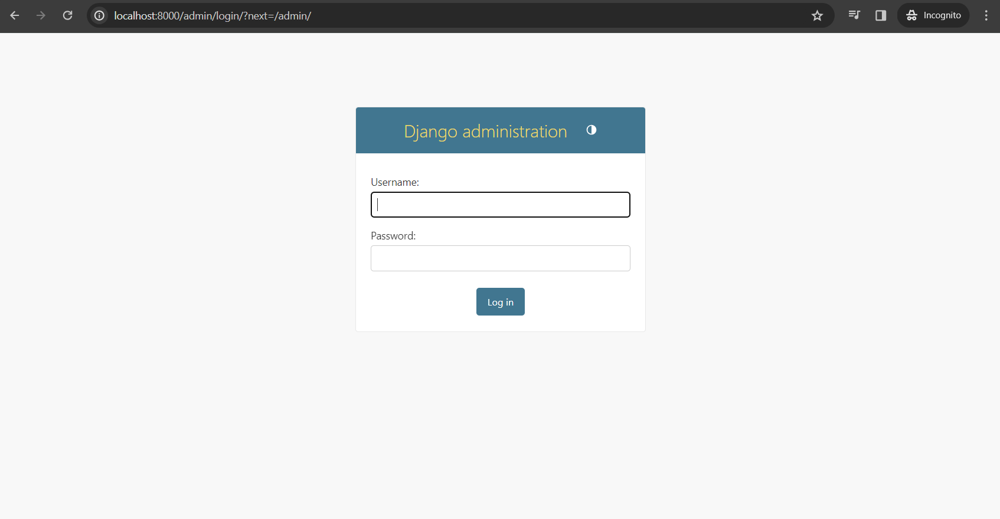
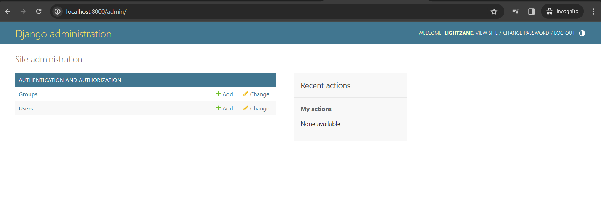
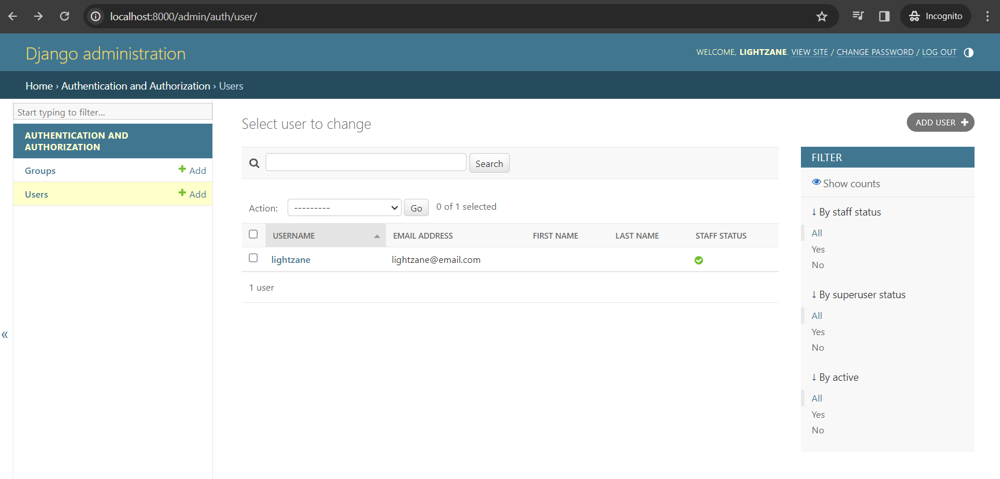
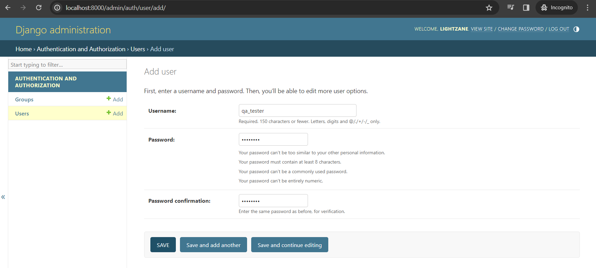

# 04 - Admin Page

https://www.youtube.com/watch?v=1PkNiYlkkjo&list=PL-osiE80TeTtoQCKZ03TU5fNfx2UY6U4p

Run your server and access http://localhost:8000/admin

```bash
python manage.py runserver
```

And you should be able to see this following page:



## Create Admin User

```bash
python manage.py createsuperuser
```

You will get a lot of errors, but the summary is `no such table: auth_user`

The problem is we have not created the database that we're going to use for this project yet.

## Initialize Database (`makemigrations`)

But it's easy to do. We just have to run a few _migration_ commands. Database _migration_ allows us to apply changes in the database.

Since we have not created any database yet, the **first _migration_ command will create** the default tables for us.

```bash
python manage.py makemigrations
```

Result: `No changes detected` - since this is initial and we have not created any changes yet in any database/models.

> If you forgot subcommands, just run the command `python manage.py` to display available subcommands

`makemigrations` will just detect the changes and prepares **Django** to update the database but it does not actually run those changes yet.

## Apply migrations (`migrate`)

```bash
python manage.py migrate
```

**RESULT**

```bash
Operations to perform:
  Apply all migrations: admin, auth, contenttypes, sessions
Running migrations:
  Applying contenttypes.0001_initial... OK
  Applying auth.0001_initial... OK
  Applying admin.0001_initial... OK
  Applying admin.0002_logentry_remove_auto_add... OK
  Applying admin.0003_logentry_add_action_flag_choices... OK
  Applying contenttypes.0002_remove_content_type_name... OK
  Applying auth.0002_alter_permission_name_max_length... OK
  Applying auth.0003_alter_user_email_max_length... OK
  Applying auth.0004_alter_user_username_opts... OK
  Applying auth.0005_alter_user_last_login_null... OK
  Applying auth.0006_require_contenttypes_0002... OK
  Applying auth.0007_alter_validators_add_error_messages... OK
  Applying auth.0008_alter_user_username_max_length... OK
  Applying auth.0009_alter_user_last_name_max_length... OK
  Applying auth.0010_alter_group_name_max_length... OK
  Applying auth.0011_update_proxy_permissions... OK
  Applying auth.0012_alter_user_first_name_max_length... OK
  Applying sessions.0001_initial... OK
```

You would also notice that it did create/update the following files:

- `db.sqlite3`

## Rerun command to create Admin or superuser

```bash
python manage.py createsuperuser
```

**RESULT**

```bash
Username (leave blank to use 'lightzane'): lightzane
Email address: lightzane@email.com
Password:
Password (again):
Superuser created successfully.
```

## Login to Admin page





## Add User

Add user, save then also update its profile to include email address.


